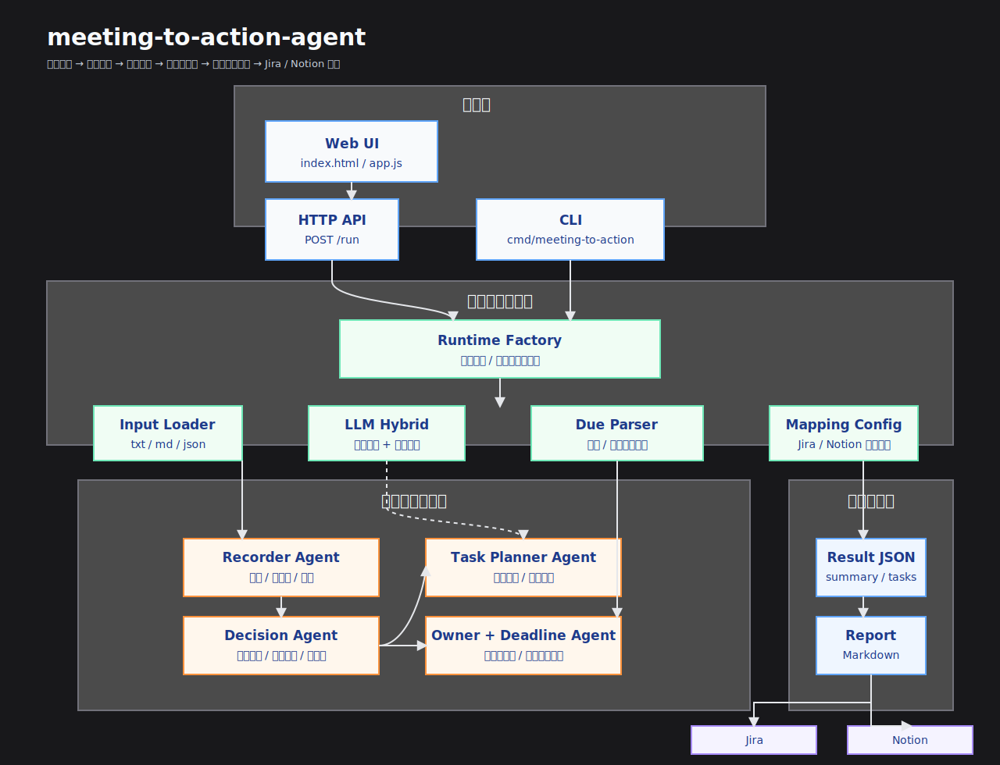

目标 会议记录 -> 决策提取 -> 任务拆解 -> 责任人识别 -> 截止时间补全 -> 同步到 Jira/Notion

多 Agent 协作架构
可以设计成几个角色型 Agent：

Recorder Agent：整理会议内容
Decision Agent：识别关键决策
Task Planner Agent：拆解成可执行任务
Reviewer Agent：检查任务是否缺负责人、截止时间、依赖关系
这比单一 prompt 更像真正的 agent system，简历里会更有技术含量。

---

## 执行子任务清单（Go 实现）

- [x] T1 初始化 Go 项目结构（`go.mod`、目录约定、CLI 入口）
- [x] T2 实现 `Recorder Agent`：会议文本清洗与结构化整理
- [x] T3 实现 `Decision Agent`：关键决策识别与抽取
- [x] T4 实现 `Task Planner Agent`：把决策拆成可执行任务
- [x] T5 实现负责人识别（Owner 提取规则）
- [x] T6 实现截止时间补全（绝对/相对时间解析 + 默认策略）
- [x] T7 实现 `Reviewer Agent`：补齐负责人、截止时间、依赖关系并校验
- [x] T8 实现 Jira/Notion 同步适配层（支持 `dry-run`）
- [x] T9 实现端到端编排器（多 Agent 串联）
- [x] T10 补充测试（单元测试 + 集成测试）
- [x] T11 测试通过后提交并推送到 GitHub
- [x] T12 编写 `log.md`，汇总每个 commit 的改动

## 测试验证

- [x] `go test ./...` 通过（使用仓库内 `GOCACHE/.gocache` 与 `GOTMPDIR/.gotmp` 执行）

---

## 二期子任务清单（持续完善）

- [x] P1 支持多格式输入（`txt/md/json`）并自动提取会议日期
- [x] P2 新增 Markdown 结果报告导出（用于复盘与周报）
- [x] P3 同步层增强：失败重试（429/5xx/网络错误）与指数退避
- [x] P4 编排器增强：Jira/Notion 并行同步 + 同步超时控制
- [x] P5 增加工程化保障：GitHub Actions 自动测试
- [x] P6 补充测试覆盖新增能力并验证通过
- [x] P7 更新 README 与 log，提交并推送

## 二期测试验证

- [x] `go test ./...` 通过（新增 `input/report/retry/timeout` 测试）

---

## 三期子任务清单（API + LLM + 字段映射）

- [x] R1 增加 HTTP API 服务版（`POST /run`）供前端/Webhook 调用
- [x] R2 接入 LLM 混合模式（规则 + 模型）增强决策/任务抽取
- [x] R3 Jira/Notion 字段映射配置化（支持团队自定义模板）
- [x] R4 补充测试（API、LLM 融合、字段映射）
- [x] R5 更新 README 与 log，提交并推送

## 三期测试验证

- [x] `go test ./...` 通过（新增 `api/config/llm/runtime` 测试）

---

## 四期子任务清单（前端交互页）

- [x] F1 新增单页前端（会议记录输入 + 概览展示）
- [x] F2 打通“先预览后确认”流程（接受后同步 Jira/Notion）
- [x] F3 打通“拒绝并反馈”流程（收集意见并触发改写）
- [x] F4 连接后端 API（`/run`）并展示错误/加载/结果状态
- [x] F5 补充测试（至少覆盖静态页面可访问）
- [x] F6 更新 README 与 log，提交并推送

## 四期测试验证

- [x] `go test ./...` 通过（新增 Web 页面访问测试）

---

## 五期子任务清单（前端配置小工具）

- [x] G1 前端新增配置小工具（后端 LLM Key、Notion 文档 Key、Jira 项目 Key）
- [x] G2 前端将工具配置透传到 `/run` 请求
- [x] G3 后端 API 支持请求级 key 覆盖（LLM/Notion/Jira）
- [x] G4 运行时工厂支持请求级 key 覆盖初始化
- [x] G5 补充测试并更新文档、提交推送

---

## 六期子任务清单（多智能体总控增强）

- [x] H1 扩展领域模型：补充 `source_text`、`acceptance_criteria`、`risk_flags`、`confidence`、`conflicts`、`follow_up_questions`
- [x] H2 实现 `Owner Agent`：职责归属识别与明确/模糊责任区分
- [x] H3 实现 `Deadline Agent`：绝对/相对时间识别与合理截止时间补全
- [x] H4 强化 `Task Planner Agent`：最小可执行任务拆解、来源依据、验收标准生成
- [x] H5 强化 `Reviewer Agent`：风险识别、冲突检测、追问问题生成
- [x] H6 更新 `LLM` schema 与规则/模型融合逻辑，兼容新增字段
- [x] H7 补充测试（Owner/Deadline/Acceptance/Risk/Conflict/Follow-up/集成流程）
- [x] H8 更新 README、log，并在任务完成后于 `AGENT.MD` 追加架构图

## 六期测试验证

- [x] `go test ./...` 通过（新增 Recorder/Decision/Owner/Deadline/Reviewer/LLM/Report/Orchestrator 测试）

## 六期架构图

